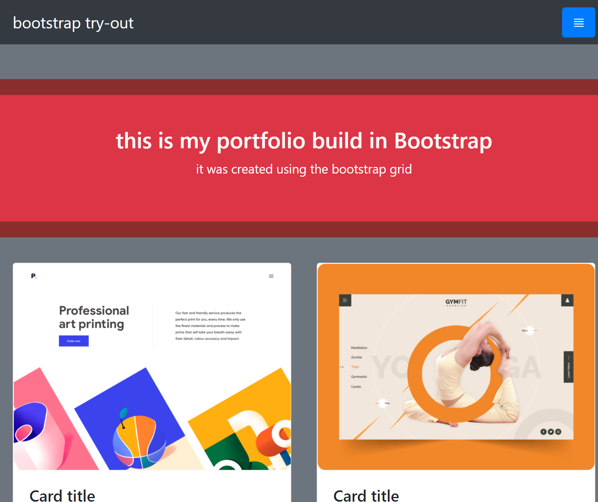

# Project Name

> Bootstrap try out

Project to try out bootstrap elements and features

## Built With

- HTML
- CSS
- Bootstrap

## Live Demo

[Live Demo Link](https://livedemo.com)

## Getting Started

If you want to use this portfolio as a template, you can do so; follow the instructions below.

Download it directly by ZIP, open the index file in a text editor, and you can change the content to match your own. If you would like to add your own projects, you can click on the button that says 'code' on the top of this repository, and clone it to your local machine. Or fork this repo and use it on Github. After downloading you can directly open the index.html file in any kind of text editor to make adjustments. Or open in a web browser to view your new site.

A pull request would be accepted if you can add nice fueteres, or have any other good idea.

### Prerequisites

### Setup

### Install

### Usage

### Run tests

### Deployment

## Authors

👤 **Author1**

- GitHub: [@githubhandle](https://github.com/githubhandle)
- Twitter: [@twitterhandle](https://twitter.com/twitterhandle)
- LinkedIn: [LinkedIn](https://linkedin.com/in/linkedinhandle)

👤 **Author2**

- GitHub: [@githubhandle](https://github.com/githubhandle)
- Twitter: [@twitterhandle](https://twitter.com/twitterhandle)
- LinkedIn: [LinkedIn](https://linkedin.com/in/linkedinhandle)

## 🤝 Contributing

Contributions, issues, and feature requests are welcome!

Feel free to check the [issues page](../../issues/).

## Show your support

Give a ⭐️ if you like this project!

## Acknowledgments

- Hat tip to anyone whose code was used
- Inspiration
- etc

## 📝 License

This project is [MIT](./MIT.md) licensed.
